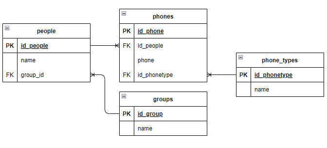
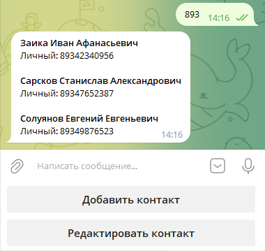
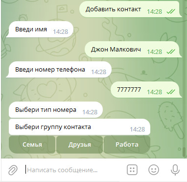
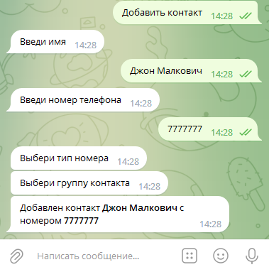
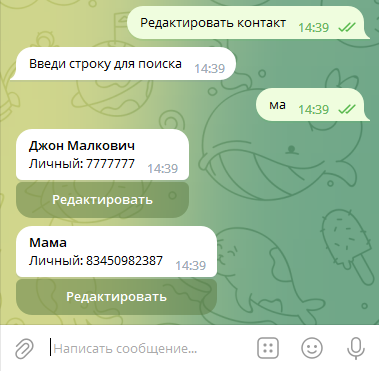
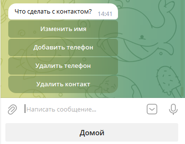
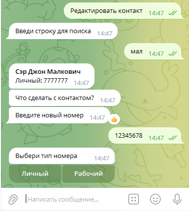
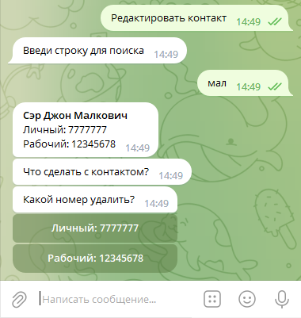
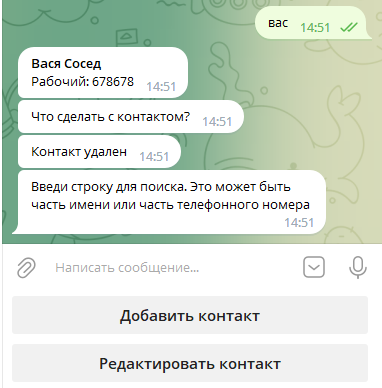

# Телеграм-бот "Телефонная Книга"

## Что это?
Бот представляет собой привычную телефонную книгу.

Реализована возможность поиска, изменения и удаления контактов.

Контакту можно назначить несколько номеров разного типа (**Личный** или **Рабочий**) а так же назначить группу, к которой он относится (**Семья**, **Друзья** или **Работа**).
Контакты можно редактировать, изменяя имя, а так же добавляя или удаляя номера телефонов. 

Ненужные контакты можно удалить.

## Что для этого нужно?
Бот реализован на **Python**. Для хранения данных используется **SQLite**

База данных имеет следующую структуру:

## А покажите...
### **Поиск**
После запуска бота можно сразу приступать к поиску контактов. Достаточно ввести часть имени или телефонного номера:

### **Добавление контакта**

Для того, чтобы добавить контакт, нужно нажать соответствующую кнопку. После этого последовательно ввести:
* **Имя**
* **Номер**
* Выбрать **Тип номера**
* Выбрать **Группу**, в которую будет добавлен контакт

### **Редактирование контакта**
Для редактирования контакта нажимаем кнопку **Редактировать контакт**

Затем вводим строку для поиска:

Затем нужно нажать кнопку **Редактировать** под нужным номером, далее выбрать, что же мы с этим контактом хотим сделать:

**Изменить имя:**

**Добавить телефон:**

**Удалить телефон:**

**Удалить контакт:**

